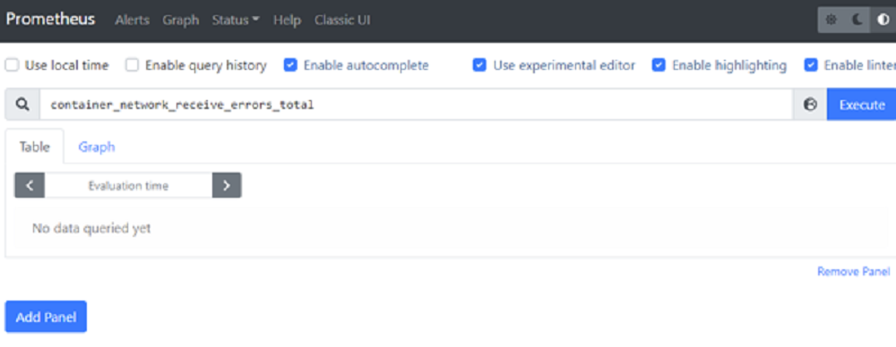
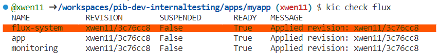

# Prometheus

- From the `PORTS` tab, open `Prometheus (30000)`
  - From the query window, enter `myapp`
    - This will filter to your custom app metrics
  - From the query window, enter `webv`
    - This will filter to the WebValidate metrics



# Fleet Creation

## Creating VM with a different size in a different region

>By default, flt will create resources in westus3 location with "Standard_D4as_v5" for VM size. If there is an quota limitation in that region, you can run the following commands to switch to a different region/VM size.

```bash

# list the available regions and resources under the current Azure subscription
# the SolDevEx PM subscription is not available in centralus region
az vm list-skus --location centralus/eastus --size Standard_D4as --all --output table

# specify the location and sku in fleet create command
flt create cluster -c [your cluster name] -l [location] --sku [sku] --verbose

# EXAMPLE:
flt create cluster -c xwen11 -l eastus --sku "Standard_DC2s_v2" --verbose

```

# Setup GitOps with Flux

- Create a clean cluster

  ```bash

  # WARNING: This will delete the your current cluster and remove the reference app. 
  kic cluster create

  # wait for pods to start
  kic pods

  ``

- Install Flux on the cluster

  ```bash

  kic cluster flux-install

  # force flux to sync
  kic sync

  # check flux status
  kic check flux

  # check pods
  kic pods

  ```


