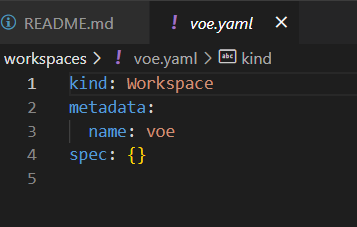
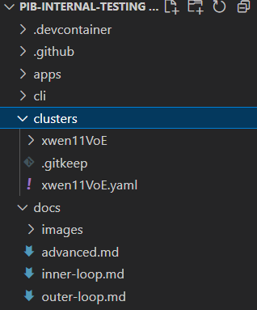
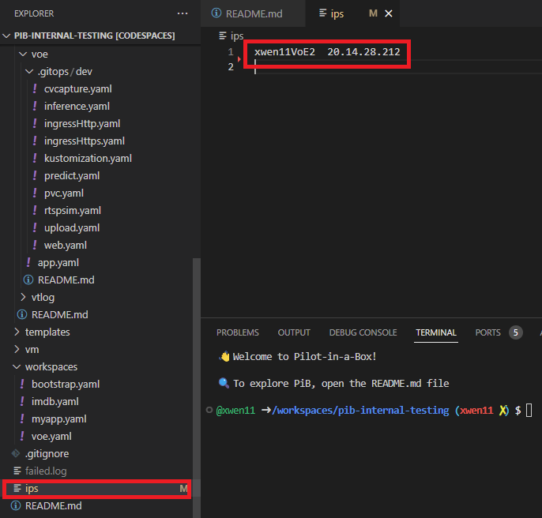
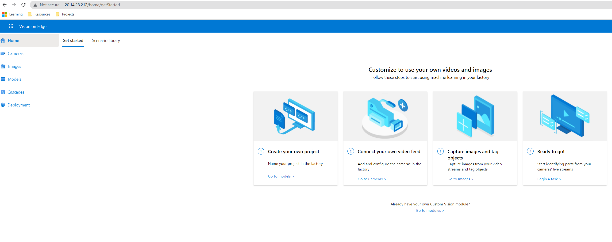

# Outer-loop (App Deployment)

This guide will teach you how to deploy any application to a fleet and clean it up after you are done with the testing. In PiB, we provide a collection of sample applications listed below:

- `dogs-cats`: A simple web server written in Go that uses Redis
- `httpbin`: A simple HTTP request & response service
- `imdb`: A k8s reference app written in C#
- `voe`: A custom Vision on Edge application based off of <https://github.com/Azure-Samples/azure-intelligent-edge-patterns/tree/master/factory-ai-vision>

## Step 1: Choose the sample app to deploy

>**Note**
Make sure you have followed the app specific setup before.
For VoE, please check the prerequisites set up in [VoE readme](./voe/README.md)

```bash

# you can choose any of the other available sample apps. For example, if you want to deploy voe, then set the value to be voe 
export PIB_APP=voe

```

## Step 2: Copy app yaml files to apps directory

Our sample-apps folder pre-define all the yaml files for sample apps GitOps deployment. Depending on the app you want to deploy, copy its yaml files into app directory which will then be picked up by GitOps later.

```bash

# cd to the sample-apps directory
cd ..
cd sample-apps

# copy the app's yaml files to apps directory
cp -aR ./$PIB_APP ../apps

# commit and push to GitHub. Make sure you are working on your own branch by running "git branch"
git add ../
git commit -am "Adding $PIB_APP app"
git push

```

## Step 3: Create a workspace for the sample app

```bash

# cd to the workspaces directory
cd ../workspaces

# create a workspace
cat <<EOF > "./$PIB_APP.yaml"
kind: Workspace
metadata:
  name: $PIB_APP
spec: {}
EOF

```

Your wokspace yaml file should look like below



```bash

# commit and push to GitHub
git add .
git commit -am "Adding $PIB_APP workspace"
git push

```

## Step 4: Deploy the app to the target fleet

```bash

cd ../apps/$PIB_APP

# check deploy targets (should be [])
flt targets list

# clear the targets if not []
flt targets clear

# add all clusters as a target
flt targets add all

# deploy the changes
flt targets deploy

```

## Step 5: Check deployment

You can check your app deployment in GitHub Action. Once the GitHub action completes successfully, you can run the following command which uses GitOps flux to sync your repo with the cluster.

```bash

# you should see the sample app added to your cluster
git pull

```



```bash

# force flux to sync
flt sync

# check that the is deployed to your cluster
flt check app $PIB_APP

# curl the app's endpoints
# depending on the sample app you will need to update the endpoints
flt curl /healthz
flt curl /readyz

```

## Step 6: Verify your app deployment

You can find your app through the IP address in the IP file like below:



Let's take VoE for example. Your web page would look like below:



## Step 7: Clean up

After you are done with the experimenting, please remember to clean up the Azure resources to save the cost.
