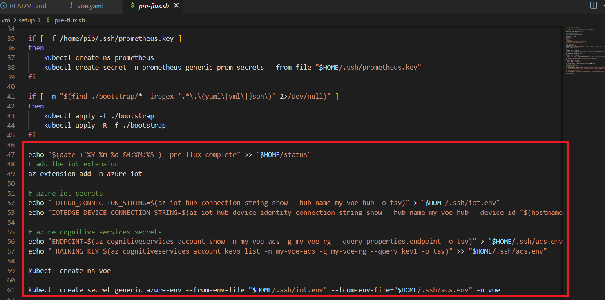
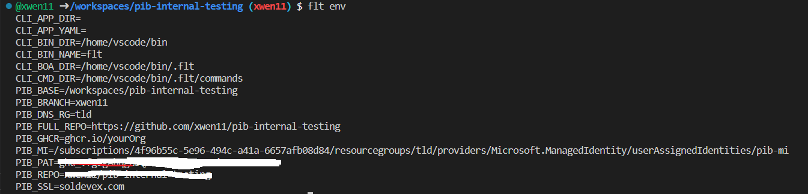

# Vision on Edge (VoE) Demo App

VoE is an open-source tool that build vision-based intelligent edge solutions using Machine Learning. You can train your own custom ML models using trainning data from the IP cameras and even deploy your ML models back to your IP cameras to extract and analysis the insights. You can go to this [page](https://github.com/Azure-Samples/azure-intelligent-edge-patterns/tree/master/factory-ai-vision) if you need more information. VoE is deployable to multiple devices. In this scenario, we will use a simulated Azure IoTEdge device (Azure VM) as an example.

In this scenario, you will follow the guidance below to learn deploying VoE to a kubernetes cluster through Pilot-in-a-Box. This experience will provide you the knowledge of building a real-world app on edge environment and understanding of the difference between edge and non-edge development environment.

## Step 0: Seting up your codespace and development environment

Please go to [Outerloop Prerequisites doc](../docs/outer-loop-Prerequisites.md) for more details if you haven't set up your working environment.

## Step 1: Creating all the dependencies for VoE

VoE has the dependencies on Azure Cognitive Service, Azure IoT hub. In order to successfully deploy VoE, you need to configure the corresponding Azure resources properly. The guidance below will walk you through how to create those resources and set up the credentials.

### Step 1.1: Creating Azure Resources

```bash

# Define the variables

export VOE_HUB_NAME=[Your hub name]

export VOE_RG=[Your resource group name]

export VOE_AZ_COG_SVC_NAME=[Your ACS name]

# Login to Azure CLI

az login --use-device-code

```

#### Step 1.1.1: Creating Azure IoT Hub

VoE is using Azure IoT Hub for communications between Azure and the edge device. Follow the steps below to create a new hub under your resource group.

```bash

# add azure-iot extension

az extension add -n azure-iot

az iot hub create --resource-group $VOE_RG --name $VOE_HUB_NAME

```

#### Sep 1.1.2: Creating Azure Cognitive Services

VoE uses Azure Cognitive Services for object detection and analyze the content in videos. In this step, we will teach you how to set up the Azure Cognitive Services for VoE.

```bash

# you may have to create a cognitive services multi-service account in the azure portal to fulfill the requirement to agree to the responsible AI terms for the resource
az cognitiveservices account create --kind CognitiveServices --name $VOE_AZ_COG_SVC_NAME --resource-group $VOE_RG --sku S0 --location westus

```

### Step 1.2: Updating fleet creation script

After creating the IoT hub and Azure Cognitive Service, you need to configure their secrets and make sure VoE can talk to them properly.
Adding the following lines at the end of the vm/setup/pre-flux.sh. Replacing the values in [] with the names of the resources created. After you finish modifying the script, run git commands to push the changes to the remote branch. Check the image below for the outcome.

```bash

# add the iot extension
az extension add -n azure-iot

# azure iot secrets
echo "IOTHUB_CONNECTION_STRING=$(az iot hub connection-string show --hub-name [your-voe-hub-name] -o tsv)" > "$HOME/.ssh/iot.env"
echo "IOTEDGE_DEVICE_CONNECTION_STRING=$(az iot hub device-identity connection-string show --hub-name [your-voe-hub-name] --device-id "$(hostname)" -o tsv)" >> "$HOME/.ssh/iot.env"

# azure cognitive services secrets
echo "ENDPOINT=$(az cognitiveservices account show -n [your-voe-acs-name] -g [your-voe-rg] --query properties.endpoint -o tsv)" > "$HOME/.ssh/acs.env"
echo "TRAINING_KEY=$(az cognitiveservices account keys list -n [your-voe-acs-name] -g [your-voe-rg] --query key1 -o tsv)" >> "$HOME/.ssh/acs.env"

kubectl create ns voe

kubectl create secret generic azure-env --from-env-file "$HOME/.ssh/iot.env" --from-env-file="$HOME/.ssh/acs.env" -n voe

```



### Step 1.3: Pushing the script updates to your remote branch

```bash

git add .
git commit -m "Updating pre-flux scripts"
git push

```

## Step 2: Creating VoE cluster

In this step, we will use flt create command to create a k3s cluster for VoE to deploy. The VoE application requires at least 8 cores, this must be specified at fleet creation with the --cores flag.

```bash

# The PIB_MI environment variable must be set so the fleet has access to the Azure CLI.

export PIB_MI=/subscriptions/4f96b55c-5e96-494c-a41a-6657afb08d84/resourcegroups/tld/providers/Microsoft.ManagedIdentity/userAssignedIdentities/pib-mi

# check your environment set up

flt env

```

It should look like below



```bash

# creating a single VM cluster with 8 cores
flt create -c your-cluster-name --cores 8 --verbose

```

## Step 3: Adding iot devices (clusters in fleet) to IoT Hub

Every IoT hub has an identity registry that stores information about the devices permitted to connect to the IoT hub. This step will guide you how to add the cluster created in Step 4 as a IoT device into IoT hub. You must run this command for each fleet in the cluster

```bash

az iot hub device-identity create --ee -n $VOE_HUB_NAME -d your-cluster-name

```

## Step 4: Deploying the VoE app to the fleet

Follow the steps in the [PiB App deployment](../docs/outer-loop-AppDeployment.md)
