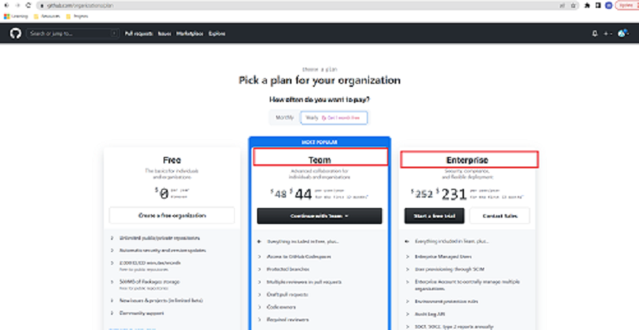
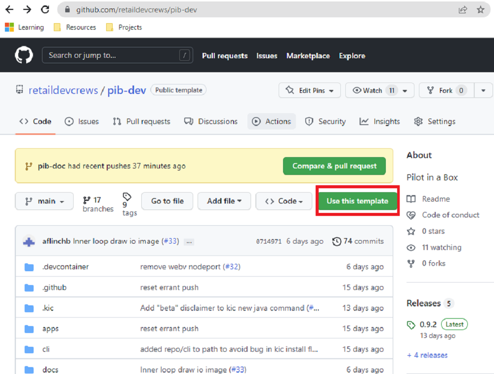
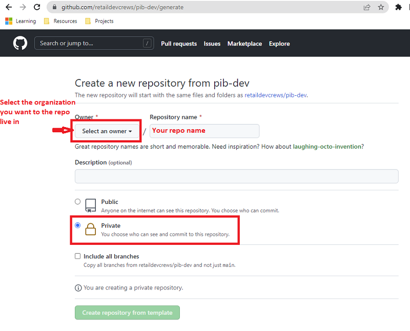
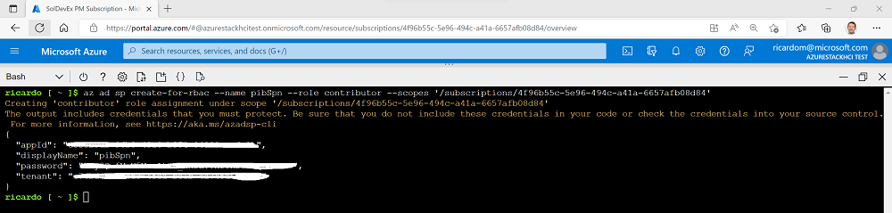
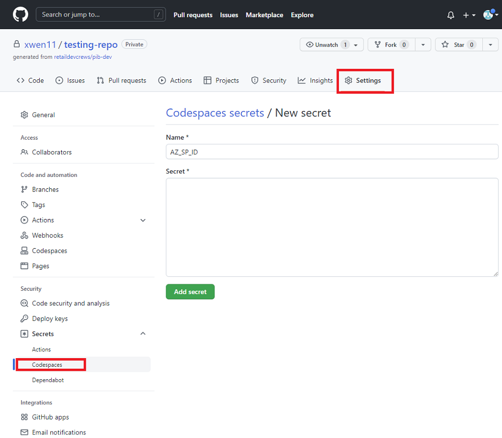

# Setting up Integration with your Azure Subscription

## Step 1: Create a new organization

- First of all, you need to create a new GitHub organization if you don't have any. Go to this page [GitHub Organization](https://github.com/organizations/plan).
- For the user testing users, please contact soldevex team to get the permission for our testing organization.

>**Note**
Currently, only Team and Enterprise plan have access to Codespaces. Since PiB uses Codespaces for local dev environment, please make sure your are selecting one of those plans when you create a new orgniazation.



## Step 2: Create your own repository

[PiB-Dev](https://github.com/retaildevcrews/pib-dev) is the major repository in PiB. It contains all the detailed instructions, basic infrastructure for PiB. It depends on a bunch of internal GitHub repositories including pib-cli repo, pib-gitops to provide the full PiB experience for users.
Use pib-dev repo as a template and create your own repo.



In the repository generation page, set owner as the organization created in the previous step and mark the repo as Private for privacy concern. (You can always change its visibility at any time).



## Step 3: Set up service principal

Create an Azure service principal (SP). To create it login to your Azure account and run the below commands.

```bash
az login

subscriptionId=$(az account show --query id --output tsv)

az ad sp create-for-rbac -n "<Your Service Principal Name>" --role "Contributor" --scopes /subscriptions/$subscriptionId


```

Example output should look similar to this:



You will need appId, password and tennat in Step 5.

## Step 4: Environment Variables

The Pilot-in-a-Box command line relies on environment variables that specify the different aspects of authentication, secret storage and the target Azure Subscription.

- todo - this should use GitHub Secrets for the env vars
- todo - add ID_RSA* to the GitHub Secrets list
- todo - links / instructions on how to initialize your Azure sub

### Step 5: Azure Account Authentication

> Optional - you can use `az login --use-device-code` instead

These are used to hold the identitiy used by the `flt` command when placing resources in the Azure Subscription. They should be passed on to the `flt login` command before executing any other flt commands.

Variable|Description
---|---
AZ_SP_ID|Your service Principal ID
AZ_SP_KEY | Your Service Principal Key (Secret)
AZ_TENANT|Your Tenant ID

Go to Settings in your repo and set the above secrets with key value pair as below:



> Note - These variables will not remove the need to run the `flt login` command. It's just an easier way of initializing the flt CLI.

### Step 6: Azure Resource Placement

These variables are required to establish security and DNS integration of the Azure Resources that are created by the `flt` commands.

Variable|Description
---|---
PIB_DNS_RG|This is the resource group that contains DNS, Manage Identity and KV to support the fleet.
PIB_MI|This is the Azure Managed Identity (make sure to grant permissions to DNS and KV)
PIB_SSL|This is the domain fqdn that is setup as part of Azure DNS

> Warning - Absence of these environment variables will disable DNS integration as part of the fleet creation. That will prevent clusters from being accessible by their FQDN.
