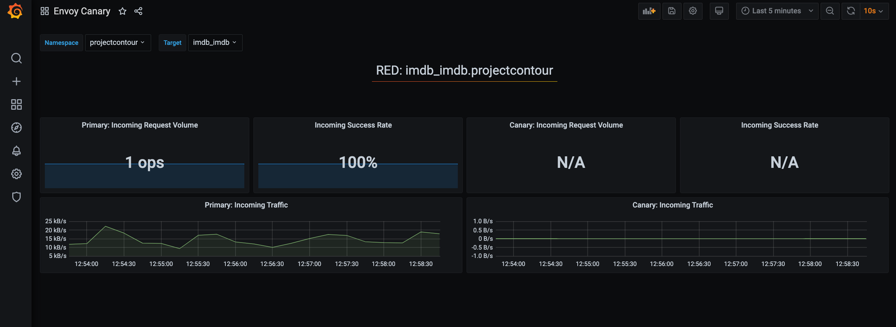

# Automated Canary deployment using Flagger

## Introduction

[Flagger](https://flagger.app/) is a progressive delivery tool that automates the release process for applications running on Kubernetes. It takes a Kubernetes deployment and creates a series of objects (Kubernetes deployments, ClusterIP services and Contour HTTPProxy) for an application. These objects expose the application in the cluster and drive the canary analysis and promotion.

## Lab Prerequisites

- Complete outer-loop [Lab 1](../../outer-loop.md) and skip the [Delete Your Cluster](../../outer-loop.md#delete-your-cluster) section

## Install Flagger

```bash

# make sure you are in canary directory
cd $PIB_BASE/labs/advanced-labs/canary

# copy flagger to apps directory
cp -R ./flagger ../../../apps

# add and commit the flagger app
cd $PIB_BASE
git add .
git commit -am "added flagger app"
git push

cd apps/flagger

# check deploy targets (should be [])
flt targets list

# clear the targets if not []
flt targets clear

# add all clusters as a target
flt targets add all

# deploy the changes
flt targets deploy

```

### Check that your GitHub Action is running

- <https://github.com/kubernetes101/pib-dev/actions>
  - your action should be queued or in-progress

### Check deployment

- Once the action completes successfully

```bash

# you should see flagger added to your cluster
git pull

# force flux to sync
# flux will sync on a schedule - this command forces it to sync now for debugging
flt sync

# check that flagger is deployed to your cluster
# NOTE: We also deploy prometheus to scrape metrics to monitor Canary deployment
flt check app flagger
flt check app prometheus

```

## Update reference app to use Canary deployment Strategy

- To update IMDb reference app to use canary deployment template:
  - Update `apps/imdb/app.yaml` with template value </br>
      `template: pib-service-canary`

    ```bash

    # deploy imdb with canary template
    cd ../imdb
    flt targets deploy

    ```

  - Once the [github action](https://github.com/kubernetes101/pib-dev/actions) is completed, force flux to sync:

     ```bash

    # force flux to sync
    # flux will sync on a schedule - this command forces it to sync now for debugging
    git pull
    flt sync

    ```

    The reference app should be updated with Canary Deployment objects listed:

    ```bash

      deployment.apps/imdb
      deployment.apps/imdb-primary
      deployment.apps/webv-imdb
      service/imdb
      service/imdb-canary
      service/imdb-primary
      service/webv-imdb
      httpproxy.projectcontour.io/imdb

    ```

  - Validate primary and canary objects in the cluster:

    ```bash

    flt ssh $MY_CLUSTER
    kic pods
    kic svc
    kubectl get canary -n imdb

    # exit from cluster
    exit

    ```

## Observe automated canary promotion

- Trigger a canary deployment by updating the container image for IMDb:
  - Update `apps/imdb/app.yaml` with image tag from `latest` to `beta` </br>
      `image: ghcr.io/cse-labs/pib-imdb:beta`

    ```bash

    # deploy imdb with updated version
    cd ../imdb
    flt targets deploy

    ```

  - Once the [github action](https://github.com/kubernetes101/pib-dev/actions) is completed, force flux to sync:

    ```bash

    # force flux to sync
    # flux will sync on a schedule - this command forces it to sync now for debugging
    git pull
    flt sync

    ```

- Observe canary promotion in k9s:

  ```bash

  # start k9s for the cluster
  flt ssh $MY_CLUSTER
  k9s <enter>

  ```

  - Type `:canaries <enter>` to view canary object
  - Observe `status` and `weight` for canary promotion

    > - Flagger detects the deployment version change and starts a new rollout with 20% traffic progression
    > - Once canary `status` is updated to `Succeeded`, 100% of the traffic should be routed to new version

  - Press `enter` again and scroll to bottom to see events
  - Press `escape` to go back
  - Exit K9s: `:q <enter>`
  - Exit from cluster: `exit <enter>`

## Monitoring Canary deployments using Grafana

Flagger comes with a Grafana dashboard made for canary analysis. Install Grafana

  ```bash

  # cd to canary directory
  cd $PIB_BASE/labs/advanced-labs/canary

  # copy flagger to apps directory
  cp -R ./flagger-grafana ../../../apps

  # add and commit the flagger-grafana app
  cd $PIB_BASE
  git add .
  git commit -am "added flagger-grafana app"
  git push

  cd apps/flagger-grafana

  # check deploy targets (should be [])
  flt targets list

  # clear the targets if not []
  flt targets clear

  # add all clusters as a target
  flt targets add all

  # deploy the changes
  flt targets deploy

  ```

Once the [github action](https://github.com/kubernetes101/pib-dev/actions) is completed and flux sync is performed, navigate to grafana dashboard by appending `/grafana` to the host url in the browser tab.

- Grafana login info
  - admin
  - change-me


