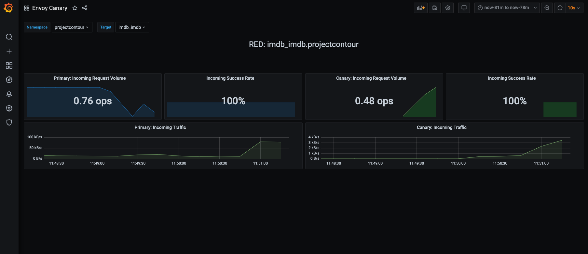
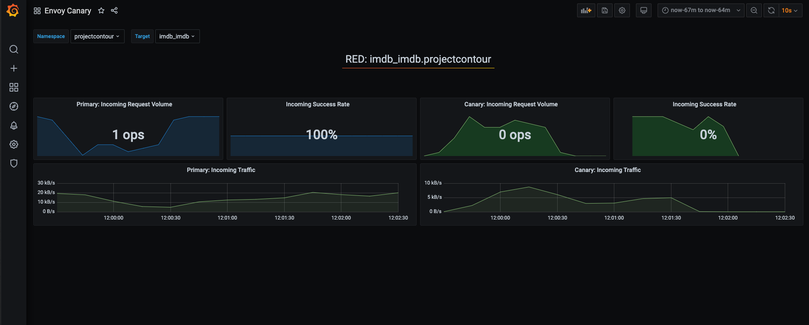

# PiB Automated Canary deployment using Flagger

## Introduction

[Flagger](https://flagger.app/) is a progressive delivery tool that automates the release process for applications running on Kubernetes. It takes a Kubernetes deployment and creates a series of objects (Kubernetes deployments, ClusterIP services and Contour HTTPProxy) for an application. These objects expose the application in the cluster and drive the canary analysis and promotion.

## Lab Prerequisites

- Complete outer-loop [Lab 1](../../outer-loop.md) and skip the [Delete Your Cluster](../../outer-loop.md#delete-your-cluster) section

## Validate cluster identifier and working branch

```bash

# make sure MY_CLUSTER is set from previous lab
echo $MY_CLUSTER

# make sure your branch is set and pushed remotely
# commands will fail if you are in main branch
git branch --show-current

```

## Install Flagger and Grafana

> Note: Grafana installation is optional. It provides visibility in to primary and canary workloads during canary analysis.

```bash

# make sure you are in the root directory
cd $PIB_BASE

# copy flagger and flagger-grafana to apps directory
cp -R ./labs/advanced-labs/canary/flagger apps
cp -R ./labs/advanced-labs/canary/flagger-grafana apps

# add and commit the flagger app
git add .
git commit -am "added flagger and grafana apps"
git push

cd apps/flagger

# check deploy targets (should be [])
flt targets list

# clear the targets if not []
# flt targets clear

# add all clusters as a target
flt targets add all

cd ../flagger-grafana

# check deploy targets (should be [])
flt targets list

# clear the targets if not []
# flt targets clear

# add all clusters as a target
flt targets add all

# deploy the changes
flt targets deploy

```

### Check that your GitHub Action is running

- <https://github.com/kubernetes101/pib-dev/actions>
  - your action should be queued or in-progress

### Check deployment

Once the action completes successfully you should see flagger added to your cluster

```bash

# pull the latest and force flux to sync
# flux will sync on a schedule - this command forces it to sync now for debugging
git pull
flt sync

# check that flagger is deployed to your cluster
# NOTE: We also deploy prometheus to scrape metrics to monitor Canary deployment
flt check app flagger
flt check app prometheus
flt check app flagger-grafana

```

## Update reference app to use Canary deployment Strategy

- Update IMDb reference app to use canary deployment template:

    ```bash

    cd $PIB_BASE

    # update imdb app.yaml with canary template
    sed -i 's,pib-service,pib-service-canary,g' apps/imdb/app.yaml

    # validate app.yaml
    cat apps/imdb/app.yaml

    # deploy imdb with canary template
    cd apps/imdb
    flt targets deploy

    ```

- Once the [github action](https://github.com/kubernetes101/pib-dev/actions) is completed, force flux to sync:

     ```bash

    # force flux to sync
    # flux will sync on a schedule - this command forces it to sync now for debugging
    git pull
    flt sync

    ```

- Validate primary and canary objects in the cluster:

    ```bash

    flt exec kic pods
    flt exec kic svc

    ```

    The reference app should be updated with Canary Deployment objects listed:

    ```bash

      deployment.apps/imdb
      deployment.apps/imdb-primary
      deployment.apps/webv-imdb
      service/imdb
      service/imdb-canary
      service/imdb-primary
      service/webv-imdb
      httpproxy.projectcontour.io/imdb

    ```


## Observe automated canary promotion

- Trigger a canary deployment by updating the container image for IMDb:

    ```bash

    # make sure you're in imdb dir
    cd $PIB_BASE/apps/imdb

    # Update imdb app.yaml with image tag from latest to beta
    sed -i 's,ghcr.io/cse-labs/pib-imdb:latest,ghcr.io/cse-labs/pib-imdb:beta,g' app.yaml

    # validate app.yaml
    cat app.yaml

    # deploy imdb with new image
    flt targets deploy

    ```

- Once the [github action](https://github.com/kubernetes101/pib-dev/actions) is completed, force flux to sync:

    ```bash

    # force flux to sync
    # flux will sync on a schedule - this command forces it to sync now for debugging
    git pull
    flt sync

    ```

- Observe canary promotion in k9s:

  ```bash

  # start k9s for the cluster
  flt ssh $MY_CLUSTER
  k9s <enter>

  ```

  - Type `:canaries <enter>` to view canary object
  - Observe `status` and `weight` for canary promotion

    > - Flagger detects the deployment version change and starts a new rollout with 20% traffic progression
    > - Once canary `status` is updated to `Succeeded`, 100% of the traffic should be routed to new version

  - Press `enter` again and scroll to bottom to see events
  - Press `escape` to go back
  - Exit K9s: `:q <enter>`
  - Exit from cluster: `exit <enter>`

- Observe canary analysis in Grafana:
  - Navigate to grafana dashboard by appending `/grafana` to the host url in the browser tab.
  - Grafana login info
    - admin
    - change-me
  - Navigate to `Envoy Canary` dashboard

  

## Observe automated rollback

- Trigger another canary deployment by updating the container image for IMDb:
  > NOTE: Image tag `pib-imdb:bad` is designed to generate HTTP 500 errors to test if Flagger pauses the rollout

    ```bash

    # make sure you're in imdb dir
    cd $PIB_BASE/apps/imdb

    # update imdb app.yaml with image tag from beta to bad
    sed -i 's,ghcr.io/cse-labs/pib-imdb:beta,ghcr.io/cse-labs/pib-imdb:bad,g' app.yaml

    # validate app.yaml
    cat app.yaml

    # deploy imdb with new image
    flt targets deploy

    ```

- Once the [github action](https://github.com/kubernetes101/pib-dev/actions) is completed, force flux to sync:

    ```bash

    # force flux to sync
    # flux will sync on a schedule - this command forces it to sync now for debugging
    git pull
    flt sync

    ```

- Observe canary rollback in k9s:

  ```bash

  # start k9s for the cluster
  flt ssh $MY_CLUSTER
  k9s <enter>

  ```

  - Type `:canaries <enter>` to view canary object
  - Observe `status` and `weight` for canary promotion

    > - Flagger detects the deployment version change and starts a new rollout with 20% traffic progression
    > - When the number of failed checks reaches the canary analysis threshold casued by HTTP 500 errors, the traffic is routed back to the primary, the canary weight is scaled to zero and the rollout is marked as `failed`

  - Press `enter` again and scroll to bottom to see events
  - Press `escape` to go back
  - Exit K9s: `:q <enter>`
  - Exit from cluster: `exit <enter>`

- Observe canary analysis in Grafana:

  

## Cleanup

- Reset IMDb app.yaml to initial state

  ```bash

  cd $PIB_BASE
  git checkout origin/main -- apps/imdb/app.yaml

  git add .
  git commit -am "reset imdb app.yaml"
  git push

  ```
- Once you're finished with the workshop and experimenting, [follow these setps](../../outer-loop.md#delete-your-cluster) to delete your cluster
