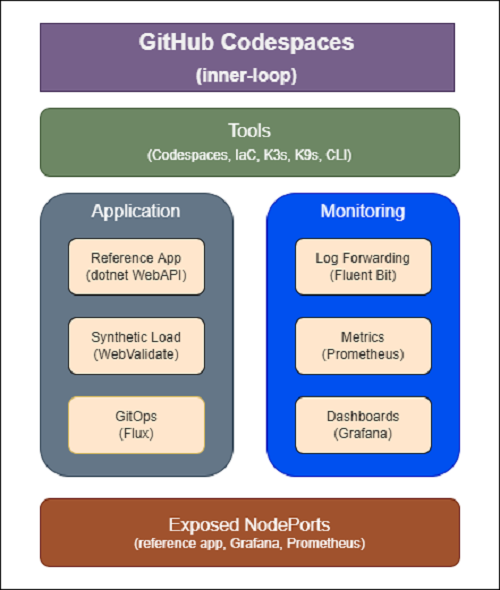

# PiB inner-loop

## Codespace Contents

- The Codespace you just created contains
  - Docker and Kubernetes development tools
  - A Kubernetes cluster running k3d
  - A full monitoring stack - Fluent Bit, Prometheus, and Grafana
  - Sample dashboards
  - A custom CLI (kic) to lower the barrier of entry for new K8s developers



## Verify k3d cluster

> The K8s cluster is running `in` your Codespace - no need for an external cluster

- Use `kic` to verify the k3d cluster was created successfully

```bash

# check pods
kic pods

```

- You can delete and recreate your cluster at any time
  - `kic cluster create`

## kic CLI

- `kic` encapsulates many of the hard concepts of K8s for the application developer
- A design requirement is that `kic` can't have any "magic"
  - Anything you can do with `kic`, you can do using standard K8s tools
- `kic` is `context aware`
- To see what most commands do, simply run the command with `--show`

  ```bash

  kic pods --show

  ```

- The `kic CLI` is customizable and extensible
  - We have a workshop under development as an advanced scenario

## Experiment with the `kic CLI`

```bash

# run kic
# notice there is not a "build" or "deploy" command
# there will be later - kic is "context aware"
kic

# this command will change later based on context
kic cluster

# kic creates a number of env vars for use in "extensions"
kic env

# some common kubectl commands - add --show to see what they do
kic events
kic ns
kic pods
kic svc

```

## Create a new .NET WebAPI

> For the workshop, use `MyApp` for the application name

- PiB includes templates for new applications that encapsulate K8s best practices
  - You can use any app name that conforms to a dotnet namespace
    - PascalCase
    - alpha only
    - <= 20 chars
- For the workshop, use `MyApp` for the application name
- Once created, you can browse the code in the Explorer window

```bash

# create a new app from the dotnet web api template
cd apps
kic new dotnet-webapi MyApp

# this is important as the CLI is "context aware"
cd myapp

```

## Build MyApp

- Now that we've created a new application, the next logical step is to `build` the app
- PiB encapsulates many best practices, so, as an App Dev, you don't have to figure out how to build a secure, multi-stage Dockerfile

```bash

# build the app
kic build all

# view docker images
docker images

```

## Deploy MyApp with Observability

> Notice you don't have to create or edit yaml files!

- This deploys
  - MyApp
  - Fluent Bit
  - Grafana
  - Prometheus
  - WebValidate (more on this later)

```bash

# optional - see what's going to happen
kic deploy all --show

kic deploy all

```

## Check the K8s pods

```bash

kic pods

# "watch" for the pods to get to Running
kic pods --watch

```

## Check each application

> Make sure that all pods are `Running`

```bash

kic check myapp
kic check webv
kic check prometheus
kic check grafana

```

## Test MyApp

- A core part of the DevX is automated integration and load testing
- We use a customized version of [WebValidate](https://github.com/microsoft/webvalidate)
  - The custom test files and Dockerfile are in the `apps/myapp/webv` directory
  - `kic build webv` builds a custom image: `k3d-registry.localhost:5500/webv-myapp:local`

## Integration Test

- The integration test checks valid and invalid URLs, so the 400 and 404 errors are part of the test design
  - By default, results < 400 are not logged
  - Add `--verbose` to the integration test to see 2xx and 3xx results

    ```bash

    # run an integration test
    kic test integration --verbose

    ```

- The last line of `kic test integration` shows the `test errors` (should be zero)
  - `Test Completed  Errors 0  ValidationErrorCount 0`

## Load Test

- Run a 5 second load test
  - Default `--duration` is 30 sec

```bash

kic test load --duration 5 --verbose

```

## `kic test` WebV Configuration

- Run the `kic test` commands with --show to view the default parameters passed to the custom webv image

```bash

kic test integration --show

# the --max-errors value should be updated
kic test integration --max-errors 5 --show

```

- See the list of requests in the custom test files in the `apps/myapp/webv` directory

```bash

code $PIB_BASE/apps/myapp/webv/integration.json

```

## Generate Requests for Observability

- PiB includes a full observability stack "in" the Codespace
  - Fluent Bit, Prometheus, Grafana
- Generate some traffic for the dashboards

```bash

# copy and paste this fence into your terminal

# run a load test in the background
kic test load &

# run several integration tests
for i in {1..10}; kic test integration;

```

## Codespaces + NodePorts

- One of the K8s networking types is [NodePort](https://kubernetes.io/docs/concepts/services-networking/service/#type-nodeport)
  - This exposes a K8s service on `localhost:nodePort`
- Codespaces is able to expose `ports` to your local browser via an `HTTPS tunnel`
- For `inner-loop` we use NodePorts to take advantage of this integration
  - For `outer-loop` we use Contour as an ingress controller

## Open MyApp in Your Browser

- Click on the `PORTS` tab at the top of your Codespaces terminal window
  - Open `App (30080)` in your browser
    - Right click or click the `open in browser` icon
    - This will display the Swagger UI for MyApp in your local browser
    - NodePorts + Codespaces handles all the port forwarding automatically!

> There are 5 unused Ports that are forwarded (30088, 31080, 31088, 32080, and 32088). These are set up for the advanced scenario of running multiple apps simultaneously on the local cluster.

## Observability: Grafana

- Grafana is a de-facto standard for K8s dashboards
- PiB deploys a Grafana instance with custom dashboards "in" your Codespace
- This is a powerful inner-loop feature as you don't have external dependencies
- Explore the [Grafana documentation](https://grafana.com/docs/) to learn about more data sources, visualizations, and capabilities

### Open Grafana in Your Browser

- From the `PORTS` tab, open `Grafana (32000)`
  - Username: admin
  - Password: cse-labs
- Click on "General / Home" at the top of the screen and select "Application Dashboard"

## Observability: Prometheus

- Prometheus is a de-facto standard for K8s metrics
- PiB deploys a Prometheus instance with `custom metrics` "in" your Codespace
- This is a powerful inner-loop feature as you don't have external dependencies
- See the [Prometheus documentation](https://prometheus.io/docs/introduction/overview/) for more information

### Open Prometheus in Your Browser

- From the `PORTS` tab, open `Prometheus (30000)`
- From the query window, enter `myapp`
  - This will filter to your custom app metrics
- From the query window, enter `webv`
  - This will filter to the WebValidate metrics

## Observability: Fluent Bit

- Fluent Bit is a de-facto standard for K8s log forwarding
  - PiB deploys a Fluent Bit instance with "in" your Codespace
- K9s is a commonly used UI that reduces the complexity of `kubectl`
  - PiB deploys k9s "in" your Codespace
- This is a powerful inner-loop feature as you don't have external dependencies
- See the [Fluent Bit documentation](https://docs.fluentbit.io/manual/) for more information

### View Fluent Bit Logs in K9s

- Fluent Bit is set to forward logs to stdout for debugging
- Fluent Bit can be configured to forward to different services including Grafana Cloud or Azure Log Analytics

- Start `k9s` from the Codespace terminal
- Press `0` to show all `namespaces`
- Select `fluentbit` pod and press `enter`
- Press `enter` again to see the logs
- Press `s` to Toggle AutoScroll
- Press `w` to Toggle Wrap
- Review logs that will be sent to Grafana when configured

> To exit K9s - `:q <enter>`
