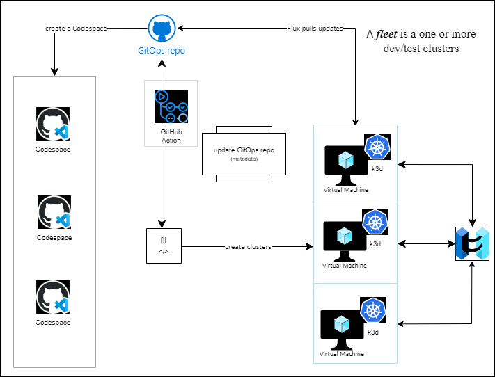

# PiB outer-loop

## Introduction

As part of PiB, we have automated the creation of dev/test clusters using a repeatable,
consistent, Infrastructure as Code approach. PiB ships a separate CLI (`flt`) for `outer-loop` dev/test clusters.

The clusters run `k3d` in an Azure Virtual Machine (VM). `flt` connects to the dev/test VMs via SSH.
Access to the dev/test fleet can be shared between Codespaces and users.

We have an advanced workshop under development for fleet sharing! Keep your eyes out.



## `flt` CLI

`flt` encapsulates many of the hard concepts of kubernetes (K8s) for the application developer,
tester, and ops team. A design requirement is that `flt` can't have any "magic." Anything you can
do with `flt`, you can do using standard K8s tools.

`flt` has rich tab completion and is "context aware"; that is, depending on your location in the
directory structure and what you have already run, different commands will be available to you.

Running `flt list` will return `Error: unknown command "list" for "flt"` when you first start, since no
fleets exist yet. TODO: CONFIRM THIS

The `flt` CLI is customizable and extensible - we have a workshop under development as an advanced
scenario! Keep an eye out!

## Experiment with the `flt` CLI

```bash
# run flt
flt

# flt creates a number of env vars for use in "extensions"
flt env

# Error: unknown command "list" for "flt"
# context aware
flt list
```

## Validate cluster identifier and working branch

```bash

# by default, MY_BRANCH is set to your lower case GitHub User Name
# the variable is used to uniquely name your clusters
# the value can be overwritten if needed
echo $MY_BRANCH

# make sure your branch is set and pushed remotely
# commands will fail if you are in main branch
git branch --show-current

```

## Login to Azure

Login to Azure using `az login --use-device-code`.

Use `az login --use-device-code --tenant <tenant>` to specify a different tenant if you have access
to more than one tenant.

If you have more than one Azure subscription, select the correct subscription:

```bash
# verify your account
az account show

# list your Azure accounts
az account list -o table

# set your Azure subscription
az account set -s mySubNameOrId

# verify your account
az account show
```

Validate the user role on the subscription, and make sure your RoleDefinitionName is `Contributor`
or `Owner` to create resources in this lab successfully.

```bash
# get az user name and validate your role assignment
principal_name=$(az account show --query "user.name" --output tsv | sed -r 's/[@]+/_/g')
az role assignment list --query "[].{principalName:principalName, roleDefinitionName:roleDefinitionName, scope:scope} | [? contains(principalName,'$principal_name')]" -o table
```

## Create a Dev Cluster

```bash
# set MY_CLUSTER.
export MY_CLUSTER=central-tx-atx-$MY_BRANCH

# create cluster
# it will take about 2 minutes to create the VM
flt create cluster -c $MY_CLUSTER
```

## Update Git Repo

`flt create` generates GitOps files for the cluster.

A GitHub action [CI-CD](https://github.com/kubernetes101/pib-dev/actions) generates the deployment
manifests. You will need to wait for CI-CD to complete, which usually takes about 30 seconds.

```bash
# update the git repo after ci-cd completes
git pull

# add ips to repo
git add ips
git commit -am "added ips"
git push
```

## Verify the Cluster Setup

> **NOTE**: If you get an SSH error, just retry every few seconds for the SSHD server to configure
> and start.

`flt create` creates the Azure VM that hosts the `k3d` cluster. Any additional setup is done via the
`cloud-init` script. We have to wait for the `k3d` setup to complete, which usually takes 3-4 minutes
after the VM setup completes.

```bash
# check the setup for "complete"
# rerun as necessary
flt check setup

# optional - use the Linux watch command
# press ctl-c after "complete"
watch flt check setup
```

## Force GitOps to Sync

We use Flux v2 for GitOps. Flux syncs on a schedule  of 1 minute. We can force Flux to sync (reconcile) immediately at any time.

```bash
# force flux to sync
flt sync

# check flux status
flt check flux
```

## Check Heartbeat

We deploy the `heartbeat` app to the cluster for observability. We check the heartbeat status and
note that heartbeat uses "Let's Encrypt" for ingress.  It can take up to 60 seconds for the "Let's
Encrypt" handshake to complete. It's normal to get a `no healthy upstream` error until the handshake
is completed.

```bash
# check that heartbeat is running on your cluster
flt check heartbeat

# another way to check
flt curl /heartbeat/17
```

## Deploy Reference App

PiB provides a reference application IMDB, which is a dotnet WebAPI that exposes actors, genres,
and movies from a subset of the IMDb data set.

`flt` provides GitOps Automation for the dev/test fleet. The `flt targets` commands control which
clusters an app is deployed to. `flt targets` is context aware, so the current directory matters!
The command can use any KV pair defined in the cluster metadata too.

`flt targets add all` is a special case that deploys to all clusters in the fleet (which is one fleet
for this lab). Note that the `all` target must be the only target specified.

An advanced workshop demonstrating `ring based deployment` can be found [here](outer-loop-ring-deployment.md).

```bash
# start in the apps/imdb directory
cd apps/imdb

# make sure repo is up to date
git pull

# add all clusters as a target
flt targets add region:central

# other options
# flt targets add region:central
# flt targets add zone:central-tx
# flt targets add district:central-tx-atx

# specify the cluster by name
# flt targets add $MY_CLUSTER

# deploy to all clusters
# flt targets clear && flt targets add all

# deploy the app via ci-cd and GitOps Automation
flt targets deploy
```

## Wait for `ci-cd` to finish

Check on the [ci-cd status](https://github.com/kubernetes101/pib-dev/actions).

## Update Cluster

Force the cluster to sync and then update the local git repo.

```bash
# should see imdb added
git pull

# force flux to reconcile
flt sync
```

## Verify IMDb was Deployed

> **NOTE**: You may have to retry the command a few times as the pods start.

```bash
# check the cluster for imdb
flt check app imdb
```

## Curl an IMDb URL

Note that IMDb uses "Let's Encrypt" for ingress. It can take up to 60 seconds for the "Let's Encrypt"
handshake to complete. It's normal to get a `no healthy upstream` error until the handshake is
completed.

```bash
flt curl /version

# curl additional URLs
flt curl /healthz
flt curl /readyz
flt curl /api/genres
flt curl /metrics
```

## Test DNS Integration

Use `http` to test your external DNS name.

```bash
# export MY_IP
cd $PIB_BASE
export MY_IP=$(cat ips | cut -f2)

http http://$MY_IP/version

http http://$MY_IP/api/genres
```

## Delete Your Cluster

Once you're finished with the workshop and experimenting, delete your cluster.

```bash
# start in the root of your repo
cd $PIB_BASE
git pull
flt delete $MY_CLUSTER
rm ips
git commit -am "deleted cluster"
git push
```

You can recreate your cluster at any time.

> **NOTE**: To reuse the same name, you have to wait for the Azure resource group to delete.

```bash
# you should see your RG in the "deleting" state
flt az groups
```
